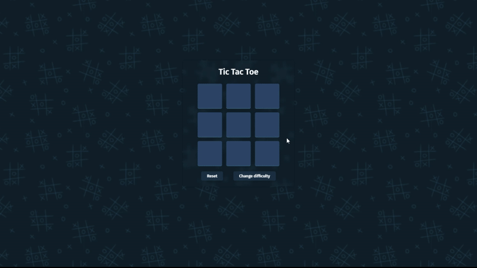

# Tic Tac Toe 🎮

A modern, responsive Tic Tac Toe game built with HTML, Sass, and JavaScript.
Play against a friend, adjust the grid size for different levels of difficulty, and enjoy smooth animations with a glassmorphism UI.

---

## Preview

---

## 🚀 Live Preview

🔗 [Click here to play live](https://gamalhafez.github.io/tic-tac-toe-game/)

---

## ✨ Features

- ✅ Classic Tic Tac Toe gameplay
- ✅ Dynamic grid size (3×3, 4×4, 5×5, …)
- ✅ Change difficulty without reloading
- ✅ Responsive design – works across desktop and mobile
- ✅ Animated UI with glass card effects
- ✅ Highlights winning cells (horizontal, vertical, diagonal)
- ✅ Reset button to start a new round instantly

---

## 🛠️ Tech Stack

- HTML5 – markup for the game board and UI
- Sass (SCSS) – modular, reusable styles with variables and mixins
- JavaScript (ES6+) – game logic, event handling, and DOM updates

--- 
## 🎮 How to Play

1. Open the game in your browser.
2. Select a difficulty (grid size).
3. Players take turns clicking on the cells.
4. First player to align their symbol (X or O) horizontally, vertically, or diagonally wins.
5. Click Reset to start a new match.

---
